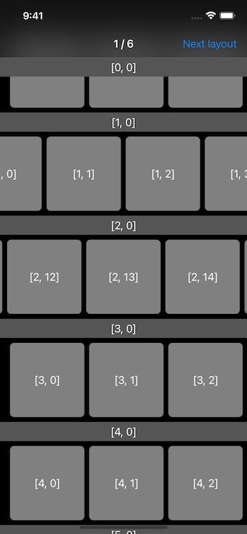

# CompositionalLayoutDSL

CompositionalLayoutDSL is a Swift library. It makes easier to create compositional layout for collection view.

---

- [Requirements](#requirements)
- [Documentation](#documentation)
- [Getting started](#getting-started)
- [Installation](#installation)
    - [CocoaPods](#cocoapods)
    - [Carthage](#carthage)
    - [Swift Package Manager](#swift-package-manager)
    - [Credits](#credits)
- [Behind the scene](#behind-the-scene)
    - [Core structs](#core-structs)
    - [Modifiers](#modifiers)
    - [DSL to UIKit Conversion](#dsl-to-uikit-conversion)
- [License](#license)

## Requirements

`CompositionalLayoutDSL` is written in Swift 5. Compatible with iOS 13.0+, tvOS 13.0+ and macOS 10.15+.

## Documentation

An online documentation can be found [here](https://fabernovel.github.io/CompositionalLayoutDSL/).

## Getting started

Here is an example from the [Example project](./Example/CompositionalLayoutDSL_Example_iOS/App/ShowcaseViewController/CompositionalLayout/GettingStartedCompositionalLayout.swift)

```swift
collectionView.collectionViewLayout = LayoutBuilder {
    Section {
        VGroup(count: 1) { Item() }
            .height(.fractionalWidth(0.3))
            .width(.fractionalWidth(0.3))
            .interItemSpacing(.fixed(8))
    }
    .interGroupSpacing(8)
    .contentInsets(horizontal: 16, vertical: 8)
    .orthogonalScrollingBehavior(.continuous)
    .supplementariesFollowContentInsets(false)
    .boundarySupplementaryItems {
        BoundarySupplementaryItem(elementKind: UICollectionView.elementKindSectionHeader)
            .height(.absolute(30))
            .alignment(.top)
            .pinToVisibleBounds(true)
    }
}
```

And here what we can see in the [Example](./Example/CompositionalLayoutDSL_Example_iOS) app



## Installation

### Cocoapods

TODO

### Carthage

TODO

### Swift Package Manager

`CompositionalLayoutDSL` can be installed as a Swift Package with Xcode 11 or higher. To install it, add a package using Xcode or a dependency to your Package.swift file:

```swift
.package(url: "https://github.com/faberNovel/CompositionalLayoutDSL")
```

## Behind the scene

Here some explanation of how this library work, it can be divided in 3 parts: the role of the core blocks,
how does the modifiers works, and how the conversion to the UIKit world is handled

### Core structs

This library contains all the core structs for creating a compositional layout, here the exhaustive list:
- `Configuration`
- `Section`
- `HGroup`
- `VGroup`
- `CustomGroup`
- `Item`
- `DecorationItem`
- `SupplementaryItem`
- `BoundarySupplementaryItem`

Each of those building blocks conforms to their respective public protocol and handle the immutable properties 
of their associated UIKit object. 

For example `SupplementaryItem` conforms to `LayoutSupplementaryItem` and handles the immutable 
properties of `NSCollectionLayoutSupplementaryItem`, which are: 
`layoutSize`, `elementKind`, `containerAnchor` and `itemAnchor`.

Those immutable properties can only be changed on those core structs, and are not available globally 
on `LayoutSupplementaryItem`. This is the same for all core structs.

### Modifiers

Mutable properties of the UIKit objects are handled by the extension of the `Layout...` protocols. 
Here some example: `contentInset(_:)`, `edgeSpacing(_:)`, `zIndex(_:)`, `interItemSpacing(_:)`, `scrollDirection(_:)`.
Changing those mutable values are done with [modifiers](./Sources/CompositionalLayoutDSL/Internal/ModifiedLayout), 
which are internal struct (e.g. [`ValueModifiedLayoutItem`](./Sources/CompositionalLayoutDSL/Internal/ModifiedLayout/ModifiedLayoutItem.swift)).
As those methods provided through extension of the `Layout...` protocol, their are available for custom
elements outside the library.

Something to note is once you applied a modifier for mutable properties you no longer have an `Item`, 
but you have a `LayoutItem`, so changing immutable values will not be possible afterward. 

### DSL to UIKit Conversion

Finally once we have combined the core structs and the modifiers, the last step is the conversion of the `Layout...` to the UIKit world.
This is done with [builders](./Sources/CompositionalLayoutDSL/Internal/Builders), they all work in a similar way.
As an example here how `ItemBuilder` works:
- It tries to find a layoutItem conforming to the internal protocol `BuildableItem` by calling repeatedly `.layoutItem` .
- Then it calls `makeItem()` on the candidate and returns it

**⚠️ Warning ⚠️**

This means that only internal struct can be converted to a UIKit object, if you try to define a custom `LayoutItem` 
and write `var layoutItem: LayoutItem { self }` like it is done internally, it will cause an infinite loop inside the ItemBuilder.

User of the library **needs** to base their custom layout on core structs provided by this library.  


## Credits

CompositionalLayoutDSL is owned and maintained by [Fabernovel](https://www.fabernovel.com/). You can follow us on Twitter at [@Fabernovel](https://twitter.com/FabernovelTech).

## License

`CompositionalLayoutDSL` is available under the MIT license. See the LICENSE file for more info.
